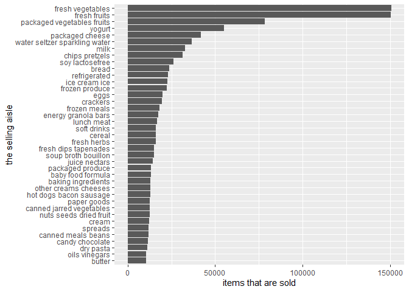

p8105\_hw3\_lg3158
================
Ling
10/17/2021

# Problem 1

``` r
data("instacart")
```

-   A short description of the dataset:

    -   The dataset `instacart` has 15 variables and 1384617
        observations. The dataset includes 21 departments and 134
        categories of products. The brief summary of this dataset is
        below.

``` r
skimr::skim(instacart)
```

|                                                  |           |
|:-------------------------------------------------|:----------|
| Name                                             | instacart |
| Number of rows                                   | 1384617   |
| Number of columns                                | 15        |
| \_\_\_\_\_\_\_\_\_\_\_\_\_\_\_\_\_\_\_\_\_\_\_   |           |
| Column type frequency:                           |           |
| character                                        | 4         |
| numeric                                          | 11        |
| \_\_\_\_\_\_\_\_\_\_\_\_\_\_\_\_\_\_\_\_\_\_\_\_ |           |
| Group variables                                  | None      |

Data summary

**Variable type: character**

| skim\_variable | n\_missing | complete\_rate | min | max | empty | n\_unique | whitespace |
|:---------------|-----------:|---------------:|----:|----:|------:|----------:|-----------:|
| eval\_set      |          0 |              1 |   5 |   5 |     0 |         1 |          0 |
| product\_name  |          0 |              1 |   3 | 159 |     0 |     39123 |          0 |
| aisle          |          0 |              1 |   3 |  29 |     0 |       134 |          0 |
| department     |          0 |              1 |   4 |  15 |     0 |        21 |          0 |

**Variable type: numeric**

| skim\_variable            | n\_missing | complete\_rate |       mean |        sd |  p0 |    p25 |     p50 |     p75 |    p100 | hist  |
|:--------------------------|-----------:|---------------:|-----------:|----------:|----:|-------:|--------:|--------:|--------:|:------|
| order\_id                 |          0 |              1 | 1706297.62 | 989732.65 |   1 | 843370 | 1701880 | 2568023 | 3421070 | ▇▇▇▇▇ |
| product\_id               |          0 |              1 |   25556.24 |  14121.27 |   1 |  13380 |   25298 |   37940 |   49688 | ▆▆▇▆▇ |
| add\_to\_cart\_order      |          0 |              1 |       8.76 |      7.42 |   1 |      3 |       7 |      12 |      80 | ▇▁▁▁▁ |
| reordered                 |          0 |              1 |       0.60 |      0.49 |   0 |      0 |       1 |       1 |       1 | ▆▁▁▁▇ |
| user\_id                  |          0 |              1 |  103112.78 |  59487.15 |   1 |  51732 |  102933 |  154959 |  206209 | ▇▇▇▇▇ |
| order\_number             |          0 |              1 |      17.09 |     16.61 |   4 |      6 |      11 |      21 |     100 | ▇▂▁▁▁ |
| order\_dow                |          0 |              1 |       2.70 |      2.17 |   0 |      1 |       3 |       5 |       6 | ▇▂▂▂▆ |
| order\_hour\_of\_day      |          0 |              1 |      13.58 |      4.24 |   0 |     10 |      14 |      17 |      23 | ▁▃▇▇▃ |
| days\_since\_prior\_order |          0 |              1 |      17.07 |     10.43 |   0 |      7 |      15 |      30 |      30 | ▅▅▃▂▇ |
| aisle\_id                 |          0 |              1 |      71.30 |     38.10 |   1 |     31 |      83 |     107 |     134 | ▆▃▃▇▆ |
| department\_id            |          0 |              1 |       9.84 |      6.29 |   1 |      4 |       8 |      16 |      21 | ▇▂▂▅▂ |

``` r
instacart_summary = instacart %>%
  group_by(aisle) %>%
  summarise(items_sold = n()) %>%
  mutate( sell_rank = min_rank(desc(items_sold))) %>%
  arrange(sell_rank)

kable(instacart_summary[1:5, ], caption = "the top 5 most ordered aisles")
```

| aisle                      | items\_sold | sell\_rank |
|:---------------------------|------------:|-----------:|
| fresh vegetables           |      150609 |          1 |
| fresh fruits               |      150473 |          2 |
| packaged vegetables fruits |       78493 |          3 |
| yogurt                     |       55240 |          4 |
| packaged cheese            |       41699 |          5 |

the top 5 most ordered aisles

-   From the summary and the table above, we can see that:
    -   There are 134 aisles;
    -   The fresh vegetable, fresh fruits, packaged vegetable fruits,
        yogurt, and packaged cheese are the aisles that most items are
        ordered from.
-   Make a plot that shows the number of items ordered in each aisle,
    limiting this to aisles with more than 10000 items ordered. Arrange
    aisles sensibly.

``` r
instacart_summary %>%
  filter(items_sold > 10000) %>%
  mutate(aisle = factor(aisle, levels = aisle[order(sell_rank, decreasing = T)])) %>%
  ggplot(aes(x = aisle, y = items_sold)) +
    geom_bar(stat = "identity") +
    labs( x = "the selling aisle",
          y = "items that are sold") +
    coord_flip()
```



-   Make a table showing the three most popular items in each of the
    aisles “baking ingredients”, “dog food care”, and “packaged
    vegetables fruits”. Include the number of times each item is ordered
    in the table.

``` r
instacart_3pops = instacart %>%
  filter(aisle == "baking ingredients" | aisle == "dog food care" | aisle ==  "packaged vegetables fruits") %>%
  select(product_name, aisle) %>%
  group_by(aisle, product_name) %>%
  summarise(items_sold = n()) %>%
  mutate(sell_rank = min_rank(desc(items_sold))) %>%
  arrange(aisle, sell_rank) %>%
  filter(sell_rank <= 3)
```

    ## `summarise()` has grouped output by 'aisle'. You can override using the `.groups` argument.

``` r
kable(instacart_3pops)
```

| aisle                      | product\_name                                 | items\_sold | sell\_rank |
|:---------------------------|:----------------------------------------------|------------:|-----------:|
| baking ingredients         | Light Brown Sugar                             |         499 |          1 |
| baking ingredients         | Pure Baking Soda                              |         387 |          2 |
| baking ingredients         | Cane Sugar                                    |         336 |          3 |
| dog food care              | Snack Sticks Chicken & Rice Recipe Dog Treats |          30 |          1 |
| dog food care              | Organix Chicken & Brown Rice Recipe           |          28 |          2 |
| dog food care              | Small Dog Biscuits                            |          26 |          3 |
| packaged vegetables fruits | Organic Baby Spinach                          |        9784 |          1 |
| packaged vegetables fruits | Organic Raspberries                           |        5546 |          2 |
| packaged vegetables fruits | Organic Blueberries                           |        4966 |          3 |

-   Make a table showing the mean hour of the day at which Pink Lady
    Apples and Coffee Ice Cream are ordered on each day of the week.

``` r
instacart_week = instacart %>%
  filter(product_name == "Pink Lady Apples" | product_name == "Coffee Ice Cream") %>%
  select(product_name, order_dow, order_hour_of_day) %>%
  group_by(product_name, order_dow) %>%
  summarise(mean_order_time = mean(order_hour_of_day)) %>%
  mutate(order_dow = replace(order_dow, order_dow == 0, "Sunday"),
        order_dow = replace(order_dow, order_dow == 1, "Monday"), 
        order_dow = replace(order_dow, order_dow == 2, "Tuesday"), 
        order_dow = replace(order_dow, order_dow == 3, "Wednesday"),
        order_dow = replace(order_dow, order_dow == 4, "Thursday"),
        order_dow = replace(order_dow, order_dow == 5, "Friday"),
        order_dow = replace(order_dow, order_dow == 6, "Saturday")) %>%
  pivot_wider(names_from =  order_dow, values_from = mean_order_time)
```

    ## `summarise()` has grouped output by 'product_name'. You can override using the `.groups` argument.

``` r
kable(instacart_week)
```

| product\_name    |   Sunday |   Monday |  Tuesday | Wednesday | Thursday |   Friday | Saturday |
|:-----------------|---------:|---------:|---------:|----------:|---------:|---------:|---------:|
| Coffee Ice Cream | 13.77419 | 14.31579 | 15.38095 |  15.31818 | 15.21739 | 12.26316 | 13.83333 |
| Pink Lady Apples | 13.44118 | 11.36000 | 11.70213 |  14.25000 | 11.55172 | 12.78431 | 11.93750 |

# problem 2

-   data importing and data cleaning

``` r
data("brfss_smart2010") 
brfss = brfss_smart2010 %>%
  janitor::clean_names() %>%
  filter(topic == "Overall Health") %>%
  rename(state = locationabbr,
         location = locationdesc) %>%
  mutate(location = substr(location, 6, 40),
         response = factor(response, levels = c("Poor", "Fair","Good", "Very good", "Excellent"))) %>%
  arrange(response)
```

-   In 2002, which states were observed at 7 or more locations? What
    about in 2010?
    -   make a summary table that count the numbers of locations
        observed across the states in different years.

``` r
brfss_loc = brfss %>%
  select(state, location, year) %>%
  filter(year == 2002 | year == 2010) %>%
  group_by(year, state) %>%
  summarize(n_loc = n()) %>%
  filter(n_loc > 7)
```

    ## `summarise()` has grouped output by 'year'. You can override using the `.groups` argument.

``` r
kable(brfss_loc)
```

| year | state | n\_loc |
|-----:|:------|-------:|
| 2002 | AZ    |     10 |
| 2002 | CO    |     20 |
| 2002 | CT    |     35 |
| 2002 | DE    |     15 |
| 2002 | FL    |     35 |
| 2002 | GA    |     15 |
| 2002 | HI    |     20 |
| 2002 | ID    |     10 |
| 2002 | IL    |     15 |
| 2002 | IN    |     10 |
| 2002 | KS    |     15 |
| 2002 | LA    |     15 |
| 2002 | MA    |     40 |
| 2002 | MD    |     30 |
| 2002 | ME    |     10 |
| 2002 | MI    |     20 |
| 2002 | MN    |     20 |
| 2002 | MO    |     10 |
| 2002 | NC    |     35 |
| 2002 | NE    |     15 |
| 2002 | NH    |     25 |
| 2002 | NJ    |     40 |
| 2002 | NV    |     10 |
| 2002 | NY    |     25 |
| 2002 | OH    |     20 |
| 2002 | OK    |     15 |
| 2002 | OR    |     15 |
| 2002 | PA    |     50 |
| 2002 | RI    |     20 |
| 2002 | SC    |     15 |
| 2002 | SD    |     10 |
| 2002 | TN    |     10 |
| 2002 | TX    |     10 |
| 2002 | UT    |     25 |
| 2002 | VT    |     15 |
| 2002 | WA    |     20 |
| 2010 | AL    |     15 |
| 2010 | AR    |     15 |
| 2010 | AZ    |     15 |
| 2010 | CA    |     60 |
| 2010 | CO    |     35 |
| 2010 | CT    |     25 |
| 2010 | DE    |     15 |
| 2010 | FL    |    205 |
| 2010 | GA    |     20 |
| 2010 | HI    |     20 |
| 2010 | IA    |     10 |
| 2010 | ID    |     30 |
| 2010 | IL    |     10 |
| 2010 | IN    |     15 |
| 2010 | KS    |     20 |
| 2010 | LA    |     25 |
| 2010 | MA    |     45 |
| 2010 | MD    |     60 |
| 2010 | ME    |     30 |
| 2010 | MI    |     20 |
| 2010 | MN    |     25 |
| 2010 | MO    |     15 |
| 2010 | MS    |     10 |
| 2010 | MT    |     15 |
| 2010 | NC    |     60 |
| 2010 | ND    |     15 |
| 2010 | NE    |     50 |
| 2010 | NH    |     25 |
| 2010 | NJ    |     95 |
| 2010 | NM    |     30 |
| 2010 | NV    |     10 |
| 2010 | NY    |     45 |
| 2010 | OH    |     40 |
| 2010 | OK    |     15 |
| 2010 | OR    |     20 |
| 2010 | PA    |     35 |
| 2010 | RI    |     25 |
| 2010 | SC    |     35 |
| 2010 | SD    |     10 |
| 2010 | TN    |     25 |
| 2010 | TX    |     80 |
| 2010 | UT    |     30 |
| 2010 | VT    |     30 |
| 2010 | WA    |     50 |
| 2010 | WY    |     10 |

From the table above, we can see that 36 states were observed at more
than 7 locations in 2002. The 36 states are AZ, CO, CT, DE, FL, GA, HI,
ID, IL, IN, KS, LA, MA, MD, ME, MI, MN, MO, NC, NE, NH, NJ, NV, NY, OH,
OK, OR, PA, RI, SC, SD, TN, TX, UT, VT, WA. 45 states were observed at
more than 7 locations in 2010, which are AL, AR, AZ, CA, CO, CT, DE, FL,
GA, HI, IA, ID, IL, IN, KS, LA, MA, MD, ME, MI, MN, MO, MS, MT, NC, ND,
NE, NH, NJ, NM, NV, NY, OH, OK, OR, PA, RI, SC, SD, TN, TX, UT, VT, WA,
WY. The number of observed location for each states for each year are
shown above.

-   make a table that summarizes the mean `data_value` in Excellent
    responses across year and state.

``` r
brfss_excellent = brfss %>%
  filter(response == "Excellent") %>%
  select(year, state, data_value) %>%
  group_by(year,state) %>%
  summarise(mean_value = mean(data_value, na.rm = T))
```

    ## `summarise()` has grouped output by 'year'. You can override using the `.groups` argument.

``` r
brfss_excellent %>%
  ggplot(aes(x = year, y = mean_value, group = state)) +
    geom_line(aes(color = state))
```


-   Make a two-panel plot showing, for the years 2006, and 2010,
    distribution of data\_value for responses (“Poor” to “Excellent”)
    among locations in NY State.
    -   first data wrangling:
        -   the data are restricted state as “NY”, and restricted year
            to 2006 and 2010.
        -   the data set contains 3 variables: year, responses (factor
            variable with 5 ordered levels), data\_value.

``` r
brfss_violin = brfss %>%
  filter((year == 2006 | year == 2010) & state == "NY") %>%
  select(year,location, response, data_value, confidence_limit_low, confidence_limit_high) %>%
  arrange(response) %>%
  ggplot(aes(x = response, y = data_value, fill = response)) +
    geom_violin() +
    labs(title = "distribution of `data_value` for responses among locations in NY State in 2006 and 2010",
         y = "prevalence(%)",
         x = "general health condition") +
    facet_wrap(~year)
brfss_violin  
```


# problem 3

-   load and cleaning data
    -   put `activity.*` into 1 column `time_min`, the original value of
        `activity.*` will be in a new variable called `activity_count`
    -   create new variable `weekday` with 2 levels: “weekday” and
        “weekend”, to show weekday vs. weekend
    -   arranged by `day_id` and `time_min`

``` r
acce = read_csv("./data/accel_data.csv",
                col_names = T) %>%
  pivot_longer(cols = starts_with("activity."),
               names_to = "time_min",
               names_prefix = "activity.",
               values_to = "activity_count") %>%
  mutate(weekday = if_else(day == "Saturday" | day == "Sunday", "weekend", "weekday"),
         day = factor(day, levels = c("Monday","Tuesday","Wednesday","Thursday","Friday","Saturday","Sunday")),
         time_min = as.numeric(time_min)) %>%
  arrange(day_id, time_min)
```

    ## Rows: 35 Columns: 1443

    ## -- Column specification --------------------------------------------------------
    ## Delimiter: ","
    ## chr    (1): day
    ## dbl (1442): week, day_id, activity.1, activity.2, activity.3, activity.4, ac...

    ## 
    ## i Use `spec()` to retrieve the full column specification for this data.
    ## i Specify the column types or set `show_col_types = FALSE` to quiet this message.

Now there are 6 variables and 50400 observations in dataset `acce`. The
6 variables are: week, day\_id, day, time\_min, activity\_count,
weekday. The activity counts ranged from 1 to 8982 in the 5-week
observation.

-   make a summary table for total activity variable for each day. The
    table should be:
    -   have 7 columns for each week day, and 5 rows for each week.
    -   the total activity variable should be the value

``` r
acce_totalac = acce %>%
  select(week, day, day_id, activity_count) %>%
  group_by(week, day) %>%
  summarise(total_activity_count = sum(activity_count, na.rm = T)) %>%
  pivot_wider(names_from = day,
              values_from = total_activity_count) %>%
  arrange(week) 
```

    ## `summarise()` has grouped output by 'week'. You can override using the `.groups` argument.

``` r
kable(acce_totalac)
```

| week |    Monday |  Tuesday | Wednesday | Thursday |   Friday | Saturday | Sunday |
|-----:|----------:|---------:|----------:|---------:|---------:|---------:|-------:|
|    1 |  78828.07 | 307094.2 |    340115 | 355923.6 | 480542.6 |   376254 | 631105 |
|    2 | 295431.00 | 423245.0 |    440962 | 474048.0 | 568839.0 |   607175 | 422018 |
|    3 | 685910.00 | 381507.0 |    468869 | 371230.0 | 467420.0 |   382928 | 467052 |
|    4 | 409450.00 | 319568.0 |    434460 | 340291.0 | 154049.0 |     1440 | 260617 |
|    5 | 389080.00 | 367824.0 |    445366 | 549658.0 | 620860.0 |     1440 | 138421 |

-   From the table above, the trends are:
    -   there is a decrease of total activity count in Tuesday and
        Saturday;
    -   there is an increase of total activity count on Wednesday and
        Sunday.
-   a single-panel plot that shows the 24-hour activity time courses for
    each day and use color to indicate day of the week.
    -   the data should be modified as:
        -   including day, time\_min, activity\_count

``` r
acce_daychange = acce %>%
  select(day_id, day, time_min, activity_count) %>%
  ggplot(aes(x = time_min, y = activity_count, color = day)) +
    geom_smooth(alpha = 0.4, se = F, size = 1) +
    scale_fill_viridis_c() +
    labs(title = "activity over the course of the day",
         x = "time in a day(min), start from 00:00 to 23:59",
         y = "activity count") +
    theme_minimal()
acce_daychange
```

    ## `geom_smooth()` using method = 'gam' and formula 'y ~ s(x, bs = "cs")'


-   From the plot, the patterns are:
    -   The patient’s activity is the lowest from 11 pm (time\_min
        around 1400 min) to 3 am (time\_min around 180 min) for all the
        weekdays.
    -   On Monday, the patient is most active during around 10-11 am
        (time\_min around 600-700 min).
    -   The patient is most active on Friday night.
    -   Generally, the patient is least active on Saturday.
